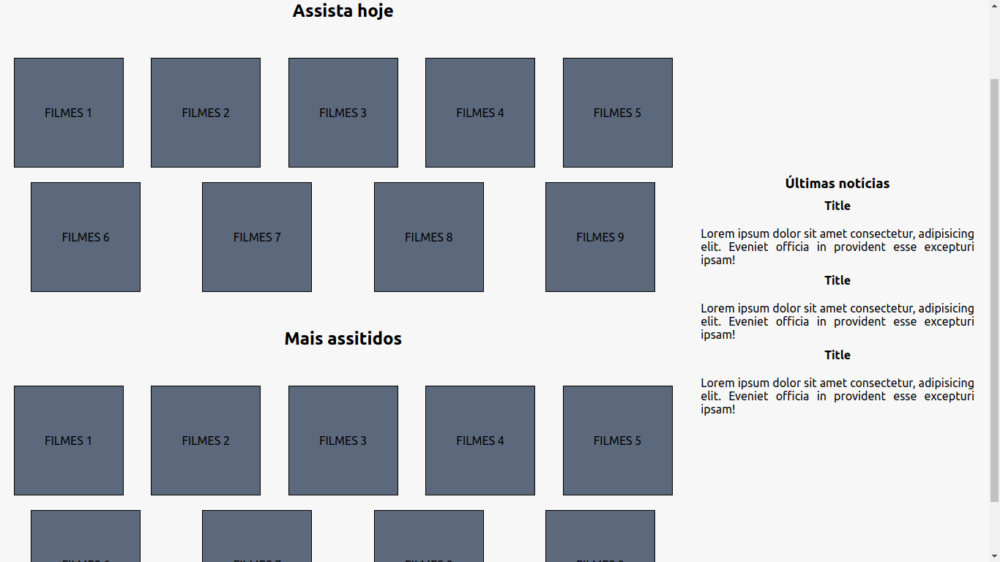

# Bloco 06: HTML e CSS: Forms, Flexbox e Responsivo

## Dia 04: CSS Flexbox - Parte 2

### O que aprendi neste dia? :books:

Aprendi mais sobre **_CSS Flexbox_**.

Na aula anterior aprendi sobre as propriedades **Flexbox** que atuam no container e neste dia 6.4 foi passado as propriedades que atuam nos items.

### Do que eu sou capaz: :rocket:

- Utilizar **_CSS Flexbox_** para criar layouts flexíveis;
- Utilizar **_CSS Flexbox_** para alterar o comportamento de _items_.

### Exercícios - Dia 04 :memo:

# TRYFLIX :p óstas: :film_projector:

> Para os exercícios a seguir, crie um arquivo HTML e um arquivo CSS , copie o código abaixo e siga as instruções de cada enunciado.

**HTML**

    <!DOCTYPE html>
    <html lang="pt">
    <head>
        <meta charset="UTF-8">
        <meta name="viewport" content="width=device-width, initial-scale=1.0">
        <title>TRYFLIX</title>
        <link rel="stylesheet" href="./style.css">
    </head>
    <body>
        <header class="header-container">
        <nav class="menu-container">
            <ul>
            <li>Cadastre-se</li>
            <li>Conecte-se</li>
            <li>Sobre</li>
            </ul>
        </nav>     
        

            
        

        </header>
        
    </body>
    </html>

**CSS**

    * {
    margin: 0;
    padding: 0;
    box-sizing: border-box;
    font-family: 'Ubuntu';
    }

    body {
    background-color: rgb(247, 247, 247);
    }

    .header-container {
    background-color: #5C687C;
    display: flex;
    }

    .logo-container {
    display: flex;
    justify-content: center;
    }

    .menu-container {
    display: flex;
    }

    .menu-container ul {
    display: flex;
    justify-content: space-around;
    width: 100%;
    }

    .menu-container li {
    color: white;
    font-weight: 500;
    font-size: 1.3rem;
    list-style: none;
    margin-right: 10px;
    }

### Parte 1

**1.** Adicione uma propriedade que defina o tamanho **Flexbox** base para o container da imagem `268px` e para o container do menu `500px`. Após aplicar as propriedades o `header` deverá estar similar a imagem abaixo:

- [x] **Header Exercicio 1**

**2.** Adicione uma propriedade **Flexbox** que modifique a **ordem** em que a logomarca e os itens do menu aparecem na tela. Após aplicar a propriedade o `header` deverá estar similar a imagem abaixo:

- [x] **Header Exercicio 2**

**3.** Adicione uma propriedade **Flexbox** que modifique o tamanho padrão do container do menu quando a largura da página for maior que `768px`. Após aplicar a propriedade o `header` deverá estar similar a imagem abaixo:

- [x] **Header Exercicio 3**

**4.** Utilize a propriedade `align-self` no elemento correto para que o `header` da página tenha o seguinte comportamento:

- [x] **Header Exercicio 4**

### Parte 2

Vamos continuar praticando com a continuação do `header` realizado no exercício acima e construir um `main` com o restante de sua página. Copie o restante dos códigos **HTML** e **CSS** e aplique a seus documentos criados anteriormente.

**HTML**

    <main class="main-container">
        

            <section>
            <h2>Assista hoje</h2>
            

                
FILMES 1

                
FILMES 2

                
FILMES 3

                
FILMES 4

                
FILMES 5

                
FILMES 6

                
FILMES 7

                
FILMES 8

                
FILMES 9

            

            </section>
            <article>
            <h2>Mais assitidos</h2>
            

                
FILMES 1

                
FILMES 2

                
FILMES 3

                
FILMES 4

                
FILMES 5

                
FILMES 6

                
FILMES 7

                
FILMES 8

                
FILMES 9

            

            </article>
        

        
        <aside class="aside-container">
            <h3>Últimas notícias</h3>

            <h4>Title</h4>
            
Lorem ipsum dolor sit amet consectetur, adipisicing elit. Eveniet officia in provident esse excepturi ipsam!

            <h4>Title</h4>
            
Lorem ipsum dolor sit amet consectetur, adipisicing elit. Eveniet officia in provident esse excepturi ipsam!

            <h4>Title</h4>
            
Lorem ipsum dolor sit amet consectetur, adipisicing elit. Eveniet officia in provident esse excepturi ipsam!

        </aside>
        </main>

**CSS**

    .main-container {
    display: flex;
    flex-wrap: wrap;
    }

    .movie-container {
    display: flex;
    flex-direction: column;
    }

    .movie-container h2 {
    margin: 40px 0;
    text-align: center;
    }

    .card-container {
    display: flex;
    flex-wrap: wrap;
    justify-content: space-around;
    }

    .card-container div {
    align-items: center;
    background-color: #5C687C;
    border: black solid 1px;
    display: flex;
    height: 150px;
    justify-content: center;
    margin: 10px;
    }

    .aside-container {
    display: flex;
    flex-direction: column;
    margin: 20px;
    }

    .aside-container h3, h4 {
    margin-bottom: 10px;
    text-align: center;
    }

    .aside-container p {
    margin: 10px 0;
    text-align: justify;
    }

**1.** Aplique uma base de `350px` para seu container `aside`. Deverá ficar similar a imagem abaixo:

- [x] **Main do Exercicio 1**

**2.** Aplique um alinhamento para centralizar e outro para expandir. Seu `aside` apresentar o seguinte comportamento:

- [x] **Main do Exercicio 2**

**3.** Adicione uma propriedade que faça com que seu container de filmes tenha uma base de `700px` e outra base de `16%` para as `div` do container de seu card. Deve ficar similar a imagem abaixo:

- [x] **Main do Exercicio 3**

**4.** Aplique uma propridade com o valor `10` que expanda o container de filmes. Deve ficar similar a imagem abaixo:

- [x] **Main do Exercicio 4**

**5.** Adicione uma propriedade com o valor `1` que faça com que suas `div` do container de filmes ocupe todo o espaço em branco. Deve ficar similar a imagem abaixo:

- [x] **Main do Exercicio 5**

### Parte 3 (opcional)

- Para finalizar, escolha alguns exercícios antigos como, por exemplo, o portfólio ou até mesmo os projetos de **_HTML_**, **_CSS_** e **_JavaScript_** e estruture as páginas utilizando **Flexbox**.

**Spoiler:** Caso queira praticar ainda mais, na seção de recursos adicionais existem alguns exercícios gamificados que são super divertidos. :rocket:
